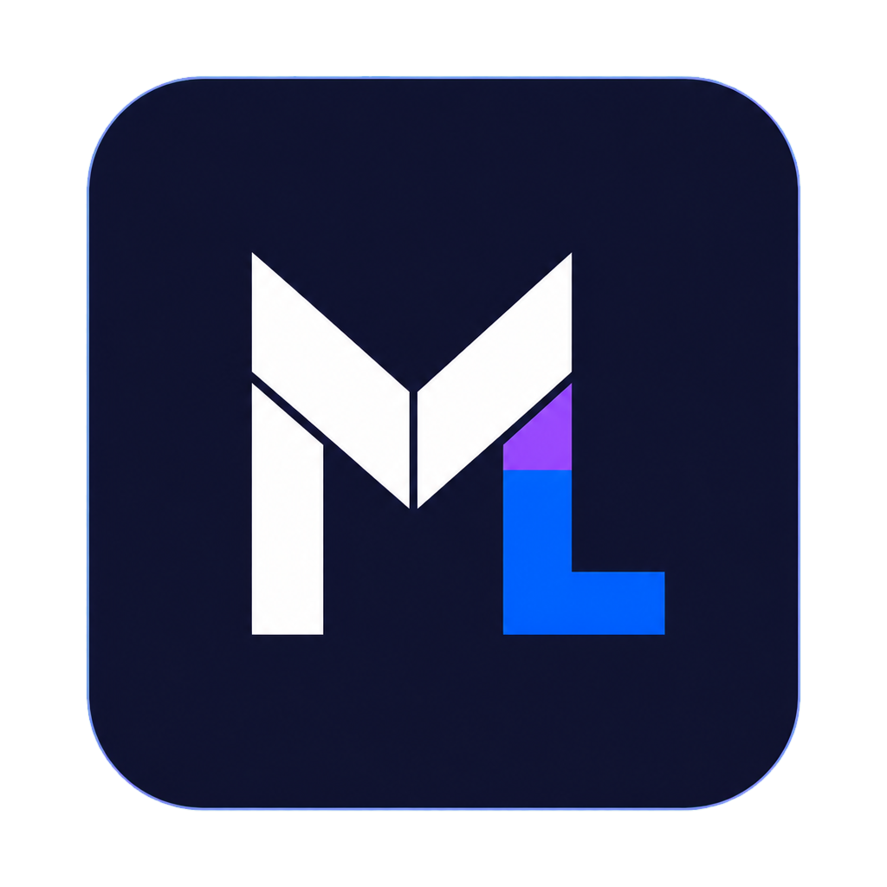

# ML Code



ML Code is a Windows-first desktop workspace for Codex, Claude Code, Cursor, Grok Build, and OpenCode. It is based on the open-source [T3 Code](https://github.com/pingdotgg/t3code) project and adds persistent employees, employee group chats, clearer employee/sub-agent identity, and Micheon/Codex pets.

Employees can work in their own chats or collaborate in shared conversations with roles such as CEO, implementer, and reviewer. ML Code uses the provider CLIs and subscriptions already installed on your computer.

## Install ML Code Alpha on Windows

1. Open [ML Code Releases](https://github.com/Leon2k909/mlcode/releases/latest).
2. Download `ML-Code-<version>-x64.exe`.
3. Run the installer. Early alpha builds are currently unsigned, so Windows may show a SmartScreen warning. Choose **More info**, then **Run anyway** only when the file came from this repository.
4. Start **ML Code (Alpha)** from the Start menu.

Installed builds check this repository for a newer release shortly after startup and every few minutes while running. When an update is available, ML Code offers to download and install it. You can also use **Settings > General > Check for Updates**.

## Employee workflow and speed controls

ML Code can route work through named employees instead of treating every turn as one undifferentiated assistant. The default roster is enabled for new chats:

- **Ceo** decides who is best suited to the request and delegates the next step.
- **Beta** researches and traces the codebase before implementation.
- **Alpha** implements the scoped change and runs focused checks.
- **Gamma** independently verifies behavior, tests, and remaining risks.

Each employee can have its own provider, model override, standing instructions, and optional **Fast mode** preference. Configure these under **Settings > Employees**. Fast mode asks the selected provider for its faster service tier when that provider supports one; providers without that capability safely ignore the preference. Leave it off to preserve the chat's normal model options.

This workflow is designed to improve speed and quality by matching work to a focused role while keeping verification separate from implementation. It is still an early-alpha feature: inspect the employee's report and test important changes before shipping them.

## Browser computer use

ML Code supports computer-use-style automation inside its collaborative browser preview. When an automation-capable preview is attached, a provider can open and navigate pages, inspect a semantic snapshot and screenshot, click, type, press keys, scroll, evaluate page JavaScript, wait for page conditions, and record the session.

This capability is limited to the embedded preview browser. It does not control arbitrary Windows applications, the global mouse or keyboard, or the entire desktop. ML Code does not currently provide a general OS-level `computer_use` bridge like a full desktop automation host.

> [!WARNING]
> Install and authenticate at least one provider before use:
>
> - Codex: install [Codex CLI](https://developers.openai.com/codex/cli) and run `codex login`
> - Claude: install [Claude Code](https://claude.com/product/claude-code) and run `claude auth login`
> - Cursor: install [Cursor CLI](https://cursor.com/cli) and run `agent login`
> - Grok Build: install [Grok Build CLI](https://x.ai/cli) and run `grok login`
> - OpenCode: install [OpenCode](https://opencode.ai) and run `opencode auth login`

## Build from source on Windows

Install [Vite+](https://viteplus.dev/guide/), clone the repository, and install dependencies:

```powershell
irm https://vite.plus/ps1 | iex
git clone https://github.com/Leon2k909/mlcode.git
cd mlcode
vp i
```

Run the development desktop app:

```powershell
vp run dev:desktop
```

Create a Windows x64 installer:

```powershell
$env:T3CODE_DESKTOP_VERSION = "0.1.0"
vp run dist:desktop:win:x64
```

## Status

ML Code is an early alpha. Expect bugs and keep important work in Git.

## Documentation

Full docs live in [docs/](./docs).

- [Install and first run](./docs/user/install.md)
- [Employees and group chats](./docs/user/employees.md)
- [Friends and shared chats](./docs/user/friends.md)
- [Pets](./docs/user/pets.md)
- [Thread goals](./docs/user/goals.md)
- [Long-thread management](./docs/user/long-threads.md)
- [Permission modes](./docs/user/permission-modes.md)
- [Keyboard shortcuts](./docs/user/keybindings.md)
- [Customize a project icon](./docs/user/project-settings.md)
- [Remote access](./docs/user/remote-access.md)
- [Keeping app and server in sync](./docs/user/updating.md)
- [Source control integrations](./docs/user/source-control.md)
- Multiple accounts: [Codex](./docs/user/providers-codex.md) · [Claude](./docs/user/providers-claude.md)

Building from source? Start at [docs/internals/overview.md](./docs/internals/overview.md). Read [CONTRIBUTING.md](./CONTRIBUTING.md) before opening an issue or pull request.

## Upstream

Made with love by Leon and Michelle.

ML Code keeps the original T3 Code Git history and license. The upstream repository is [pingdotgg/t3code](https://github.com/pingdotgg/t3code).
